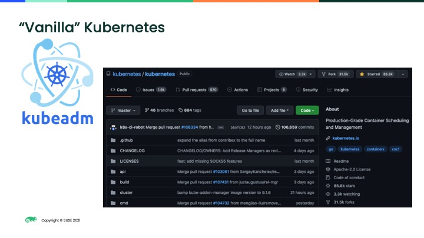
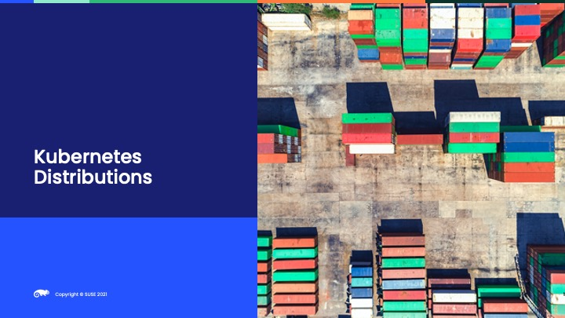
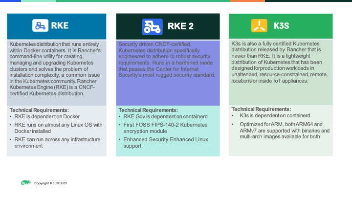
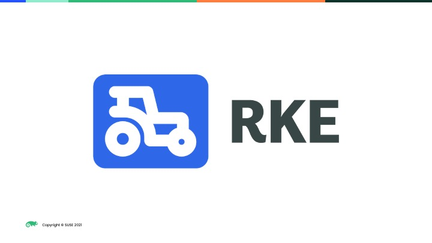
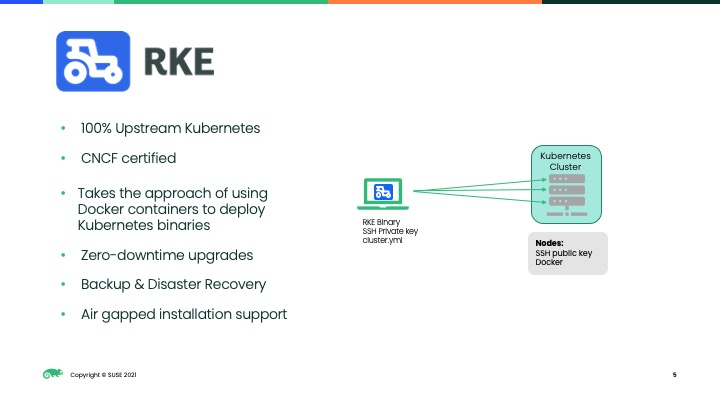
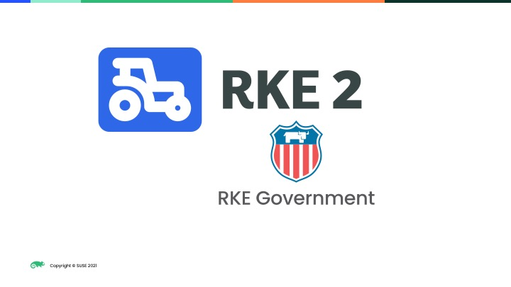
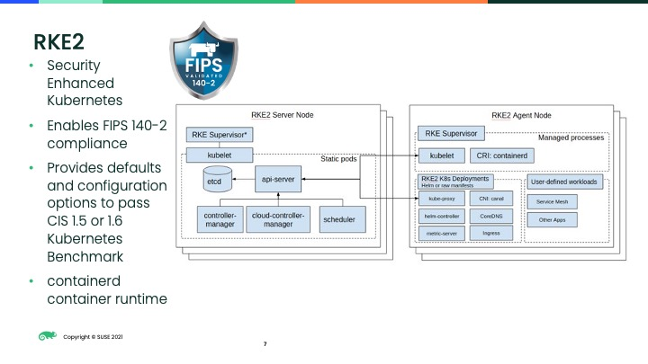
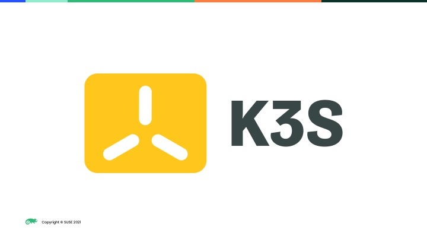
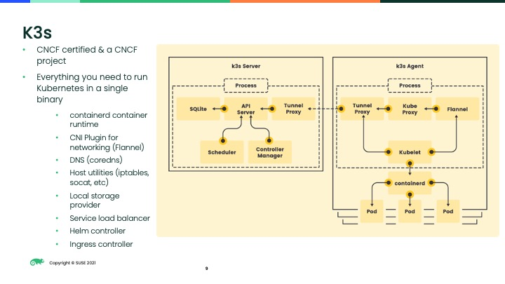

(pause: 2)

```
Kubernetes Distributions
```


(pause: 2)

<!-- Start Script -->
Vanilla Kubernetes
<!-- End Script -->
---


<!-- Start Script -->
Provisioning an upstream Kubernetes cluster straight from source code or using kube`adm`, a tool from upstream to create clusters, is difficult and does not include all the requirements for a functioning cluster like a `CNI` plugin to implement the Kubernetes networking model. Installing from source code or kube`adm` is often referred to as "vanilla" Kubernetes.
<!-- End Script -->
---


<!-- Start Script -->
Like a Linux distribution that include a kernel, shell, tools and more, a Kubernetes distribution makes installing (and upgrading) a Kubernetes cluster easier and includes all the requirements for a functioning cluster and add-ons.
<!-- End Script -->
---


<!-- Start Script -->
Soosa offers three Kubernetes distributions: Rancher Kubernetes Engine (`RKE`), `RKE2` and `K3S`.
All three distributions are CNCF Certified meaning that all three distributions support the required APIs and there is no vendor lock-in which means workloads can easily migrate from one `CNCF` Certified Kubernetes cluster to another.
In addition, all three Soosa Kubernetes distributions are easy to install, can be deployed via Terraform, have zero-downtime upgrades and can be installed in air-gap environments.

`RKE`, `RKE2`, `K3S` include all the requirements and more for a functioning Kubernetes cluster including:
- an installer to make Kubernetes installation easier
- a default Container Network Interface (`CNI`) plugin (any `CNI` can be used) that implements the Kubernetes network model: pods on node can communicate with all pods on all nodes with NAT and the kubelet (node agent) can communicate with all pods on the kubelet's node
- the Kubernetes metrics server which aggregates the cluster resource usage from the cluster's kubelets
- an ingress controller for functioning ingress resources
- declarative configuration for reliable and repeatable deployments
<!-- End Script -->
---

```
SUSE's Kubernetes Distributions
```


<!-- Start Script -->
Let's look into three Kubernetes distributions that Soosa offers
<!-- End Script -->
---

```
SUSE's Kubernetes Distributions
```

---


<!-- Start Script -->
Rancher Kubernetes Engine or `RKE`
<!-- End Script -->
---


<!-- Start Script -->
`RKE` is a container based Kubernetes distribution that uses Docker but is not affected of the Kubernetes removal of dockershim in Kubernetes v1.24.
`RKE` uses cri-dockerd which is a shim to use the Docker engine.
`RKE` is installed via a single binary and can use a single yaml configuration file to setup a cluster.
`RKE` requires `SSH` access to the machines of the cluster.
Since `RKE` is built using containers, upgrades are easy with the option to roll back.
`RKE` ships with NGINX as the default ingress controller and Canal as the default `CNI` plugin.
<!-- End Script -->
---


<!-- Start Script -->
`RKE2` formerly known as `RKE` Government is Soosa's next-generation Kubernetes distribution.
<!-- End Script -->
---


<!-- Start Script -->
`RKE2` is a hardened and FIPS-enabled Kubernetes distribution focused on security and compliance.
`RKE2` targets standard risk management frameworks and provides opetions to pass the Center for Internet Security (`CIS`) Kubernetes benchmarks.
`RKE2` enables FIPS 140-2 compliance which means `RKE2` is built with US Government approved FIPS validated cryptographic libraries.
Users can install `RKE2` with an easy-to-use installation script and configuration file.
`RKE2` uses container-d as its container runtime.
`RKE2` uses NGINX as the default ingress controller and Canal is the default `CNI` plugin.
<!-- End Script -->
---


<!-- Start Script -->
`K3s`
<!-- End Script -->
---


<!-- Start Script -->
`K3s` is a lightweight, production-ready Kubernetes distribution that Rancher donated to the `CNCF`.
`K3s` is geared towards resource constrained environments and native ARM support -- perfect for EDGE and `IoT` environments.
`K3s` is packaged as a single binary and wraps Kubernetes and other components in a single, simple launcher.
`K3s` is bundled with container-d as its container runtime.
`K3s` can run on machines as small as Raspberry Pis or on large machines in the datacenter or cloud instances.
`K3s` includes Traefik as the ingress controller and by default uses an embedded SQLite as its datastore but can use an external etcd, PostGres, or Mysql.
`K3s` also includes Klipper-lb as an embedded service load balancer provider and Flannel is the default `CNI` plugin.
<!-- End Script -->
---
